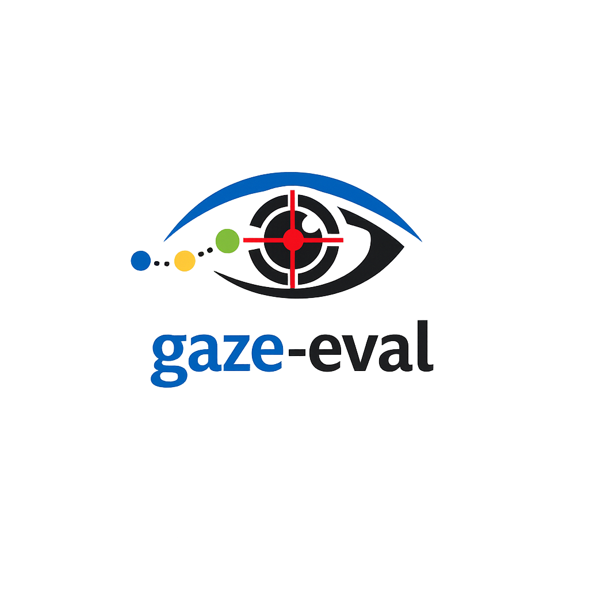

<p align="center">
  
</p>

<h1 align="center">gaze-eval</h1>

<p align="center">
  Evaluation tools for gaze prediction models, scanpaths, and saliency maps.
</p>

---

## Overview

`gaze-eval` is a Python package for evaluating gaze prediction models.

The package is designed to support two main evaluation tasks:

* scanpath prediction evaluation
* saliency-map prediction evaluation

The current version focuses on **scanpath evaluation**. It supports an NDJSON-based scanpath format, where each line represents one complete scanpath for one trial.

The package currently includes:

* scanpath metrics
* NDJSON scanpath evaluation
* UEyes and MassVis dataset loaders
* reproducible human-human scanpath pair sampling
* UEyes and MassVis human similarity benchmarks
* statistical summaries, effect sizes, bootstrap confidence intervals, and human-baseline references
* paper-table and visualization scripts for benchmark analysis

The recommended scanpath evaluation workflow is:

```text
NDJSON file
   ↓
read_scanpath_ndjson()
   ↓
list[ScanpathRecord]
   ↓
evaluate_scanpath_records()
   ↓
results DataFrame
```

Saliency-map metrics will be added later.

---

## Current Status

Implemented:

* scanpath metric functions
* scanpath metric registry
* NDJSON scanpath format
* `ScanpathRecord` representation
* record-based scanpath evaluation
* UEyes dataset loader
* MassVis dataset loader
* reproducible human-human scanpath pair sampling
* UEyes human similarity benchmark
* MassVis human similarity benchmark
* statistical summaries, bootstrap confidence intervals, effect sizes, and human-baseline references
* paper-table generation utilities
* metric-distribution visualization scripts
* dummy scanpath validation data
* basic validation tests
* scanpath metric documentation

Planned:

* saliency-map metrics
* saliency-map evaluation pipeline
* fixation-map utilities
* dataset loaders for additional gaze benchmarks
* model-vs-human benchmark scripts

---

## Installation

For local development, clone the repository and install it in editable mode:

```bash
git clone https://github.com/prviin/gaze-eval.git
cd gaze-eval
pip install -e ".[dev]"
```

If editable installation is not available in your environment, run:

```bash
PYTHONPATH=src python -m pytest
```

---

## Package Structure

```text
gaze-eval/
├── src/
│   └── gaze_eval/
│       ├── datasets/
│       │   ├── __init__.py
│       │   ├── ueyes.py
│       │   └── massvis.py
│       └── scanpath/
│           ├── records.py
│           ├── io.py
│           ├── convert.py
│           ├── evaluate_records.py
│           ├── evaluate.py
│           ├── metrics.py
│           ├── registry.py
│           ├── aggregate.py
│           ├── pair_sampling.py
│           ├── human_similarity.py
│           └── statistics.py
├── examples/
│   ├── prepare_ueyes.py
│   ├── sample_ueyes_pairs.py
│   ├── evaluate_ueyes_pair_sample.py
│   ├── make_ueyes_paper_tables.py
│   ├── plot_ueyes_metric_distributions.py
│   ├── prepare_massvis.py
│   ├── sample_massvis_pairs.py
│   ├── evaluate_massvis_pair_sample.py
│   ├── make_massvis_paper_tables.py
│   └── plot_massvis_metric_distributions.py
├── tests/
│   ├── test_scanpath_records.py
│   ├── test_ueyes_loader.py
│   ├── test_pair_sampling.py
│   ├── test_statistics.py
│   ├── scripts/
│   │   └── evaluate_ndjson_debug.py
│   └── data/
│       └── debug/
│           ├── human_scanpaths.ndjson
│           ├── pred_scanpaths.ndjson
│           ├── human_scanpaths.csv
│           ├── pred_same.csv
│           ├── pred_good.csv
│           └── pred_bad.csv
├── docs/
│   ├── scanpath_metrics.md
│   └── assets/
│       └── gaze-eval-logo.png
└── README.md
```

---

## Scanpath Data Format

The recommended scanpath format is **NDJSON**.

NDJSON means that each line is one independent JSON object.

In `gaze-eval`:

```text
one line = one trial = one complete scanpath
```

This format is easier to share, validate, and extend with metadata than a flat fixation-level CSV.

---

## Human Scanpath Example

```json
{"schema_version":"gaze-eval-scanpath-v1","source":"human","dataset":"debug","image_id":"img_001","trial_id":"human_s01_img001","subject_id":"s01","coordinate_system":{"type":"normalized","x_range":[0,1],"y_range":[0,1],"origin":"top_left"},"time_unit":"ms","duration_unit":"ms","scanpath":[{"fixation_index":0,"timestamp":0.0,"x":0.1,"y":0.2,"duration":100.0},{"fixation_index":1,"timestamp":120.0,"x":0.3,"y":0.4,"duration":150.0},{"fixation_index":2,"timestamp":300.0,"x":0.5,"y":0.6,"duration":200.0}]}
```

---

## Predicted Scanpath Example

```json
{"schema_version":"gaze-eval-scanpath-v1","source":"prediction","dataset":"debug","image_id":"img_001","trial_id":"pred_dummy_img001","prediction_id":"pred_001","model":"dummy_model","sampler":"dummy_sampler","coordinate_system":{"type":"normalized","x_range":[0,1],"y_range":[0,1],"origin":"top_left"},"time_unit":"ms","duration_unit":"ms","scanpath":[{"fixation_index":0,"timestamp":0.0,"x":0.1,"y":0.2,"duration":100.0},{"fixation_index":1,"timestamp":120.0,"x":0.6,"y":0.7,"duration":250.0},{"fixation_index":2,"timestamp":300.0,"x":0.5,"y":0.6,"duration":200.0}]}
```

---

## Required Fields

Each NDJSON row should include:

```text
schema_version
source
dataset
image_id
trial_id
coordinate_system
time_unit
duration_unit
scanpath
```

For human scanpaths, also include:

```text
subject_id
```

For predicted scanpaths, also include:

```text
prediction_id
model
sampler
```

Each fixation inside `scanpath` should include:

```text
fixation_index
timestamp
x
y
duration
```

---

## Coordinate and Time Conventions

Coordinates should be normalized:

```text
x in [0, 1]
y in [0, 1]
```

The coordinate origin is assumed to be the top-left corner unless otherwise specified in `coordinate_system`.

Durations should be reported in milliseconds.

Timestamps should also be reported in milliseconds and should represent fixation onset time relative to trial or stimulus onset.

If duration is unavailable, use:

```text
duration = -1
```

---

## Basic Scanpath Evaluation

```python
from gaze_eval.scanpath.evaluate_records import evaluate_scanpath_records
from gaze_eval.scanpath.io import read_scanpath_ndjson

human_records = read_scanpath_ndjson("tests/data/debug/human_scanpaths.ndjson")
pred_records = read_scanpath_ndjson("tests/data/debug/pred_scanpaths.ndjson")

results = evaluate_scanpath_records(
    human_scanpaths=human_records,
    predicted_scanpaths=pred_records,
    metric_names=[
        "mean_fixation_error",
        "final_fixation_error",
        "mean_duration_error",
        "duration_correlation",
        "dtw",
    ],
)

print(results)
results.to_csv("tests/data/debug/ndjson_eval_results.csv", index=False)
```

---

## UEyes Dataset Support

`gaze-eval` includes a dataset loader for UEyes and a reproducible human-human scanpath similarity benchmark.

The UEyes workflow is:

```text
raw UEyes dataset
   ↓
prepare_ueyes.py
   ↓
human_scanpaths.ndjson
   ↓
sample_ueyes_pairs.py
   ↓
fixed pair sample CSV
   ↓
evaluate_ueyes_pair_sample.py
   ↓
metric results, summaries, sanity checks, effect sizes, and human baseline references
```

### 1. Prepare UEyes

After downloading and extracting UEyes, place the dataset under:

```text
data/Ueyes/UEyes_dataset/
```

Then run:

```bash
python examples/prepare_ueyes.py
```

This creates:

```text
data/processed/ueyes/human_scanpaths.ndjson
```

Each row in this NDJSON file represents one subject-image trial:

```text
one subject × one image = one scanpath record
```

The UEyes loader preserves metadata such as:

```text
image_id
subject_id
category
split
timestamp
duration
```

The loader uses valid fixations and converts UEyes timing values to milliseconds.

### 2. Sample Reproducible UEyes Human-Human Pairs

```bash
python examples/sample_ueyes_pairs.py
```

This creates:

```text
data/processed/ueyes/pairs/ueyes_pairs_seed42.csv
```

The pair sample contains:

```text
10,000 same-image pairs
10,000 same-category pairs
10,000 different-category pairs
```

### 3. Evaluate UEyes Human Similarity

```bash
python examples/evaluate_ueyes_pair_sample.py
```

This creates:

```text
data/processed/ueyes/results/ueyes_pair_metric_results_seed42.csv
data/processed/ueyes/results/ueyes_pair_metric_summary_seed42.csv
data/processed/ueyes/results/ueyes_pair_metric_sanity_seed42.csv
data/processed/ueyes/results/ueyes_pair_metric_differences_seed42.csv
data/processed/ueyes/results/ueyes_human_baseline_quality_seed42.csv
```

### 4. Create UEyes Paper Tables and Figures

```bash
python examples/make_ueyes_paper_tables.py
python examples/plot_ueyes_metric_distributions.py
```

These scripts create paper-ready CSV, LaTeX, and figure outputs under:

```text
data/processed/ueyes/paper_tables/
data/processed/ueyes/figures/
```

---

## MassVis Dataset Support

`gaze-eval` also includes a dataset loader for MassVis and a reproducible human-human scanpath similarity benchmark.

MassVis fixation files are expected under:

```text
data/masviss_data/
├── massvis_cat_metadata.csv
├── stimuli/
└── fixationsByVis/
    └── <image_id>/
        ├── enc/
        │   └── <subject_id>.csv
        └── rec/
            └── <subject_id>.csv
```

Each MassVis fixation CSV is read as:

```text
fixation_index, x, y, duration
```

The MassVis loader supports three phases:

```python
load_massvis(root, phase="enc")
load_massvis(root, phase="rec")
load_massvis(root, phase="both")
```

The recommended main benchmark uses the encoding phase:

```text
phase = "enc"
```

because it corresponds to the original viewing phase.

The MassVis workflow is:

```text
raw MassVis dataset
   ↓
prepare_massvis.py
   ↓
human_scanpaths.ndjson
   ↓
sample_massvis_pairs.py
   ↓
fixed pair sample CSV
   ↓
evaluate_massvis_pair_sample.py
   ↓
metric results, summaries, sanity checks, effect sizes, and human baseline references
```

### 1. Prepare MassVis

Place the dataset under:

```text
data/masviss_data/
```

Then run:

```bash
python examples/prepare_massvis.py
```

This creates normalized NDJSON scanpath files:

```text
data/processed/massvis/enc/human_scanpaths.ndjson
data/processed/massvis/rec/human_scanpaths.ndjson
data/processed/massvis/both/human_scanpaths.ndjson
```

MassVis fixation coordinates are normalized by the corresponding stimulus dimensions. Fixations outside the image bounds are excluded before normalization. Visualizations without a matching stimulus image are excluded from the normalized benchmark.

Each MassVis row represents:

```text
one subject × one image × one phase = one scanpath record
```

The MassVis loader preserves metadata such as:

```text
image_id
subject_id
category
vistype
phase
stimulus_source
title
duration
```

MassVis category labels are mapped to:

```text
N → news
S → science
G → government
I → infographic
```

### 2. Sample Reproducible MassVis Human-Human Pairs

Run:

```bash
python examples/sample_massvis_pairs.py
```

This creates:

```text
data/processed/massvis/enc/pairs/massvis_pairs_seed42.csv
```

The pair sample contains:

```text
10,000 same-image pairs
10,000 same-category pairs
10,000 different-category pairs
```

Pairs are sampled with a fixed random seed and balanced across MassVis categories.

The three pair types are:

```text
same_image:
    same image, different subjects

same_category:
    different images from the same visualization category

different_category:
    different images from different visualization categories
```

### 3. Evaluate MassVis Human Similarity

Run:

```bash
python examples/evaluate_massvis_pair_sample.py
```

This creates:

```text
data/processed/massvis/enc/results/massvis_pair_metric_results_seed42.csv
data/processed/massvis/enc/results/massvis_pair_metric_summary_seed42.csv
data/processed/massvis/enc/results/massvis_pair_metric_sanity_seed42.csv
data/processed/massvis/enc/results/massvis_pair_metric_differences_seed42.csv
data/processed/massvis/enc/results/massvis_human_baseline_quality_seed42.csv
```

The benchmark checks whether scanpath metrics recover the expected human-human similarity structure:

```text
same image > same category > different category
```

For lower-is-better metrics, this corresponds to:

```text
same image < same category < different category
```

### 4. Create MassVis Paper Tables and Figures

Run:

```bash
python examples/make_massvis_paper_tables.py
python examples/plot_massvis_metric_distributions.py
```

These scripts create paper-ready CSV, LaTeX, and figure outputs under:

```text
data/processed/massvis/enc/paper_tables/
data/processed/massvis/enc/figures/
```

---

## Human-Human Similarity Benchmark

The UEyes and MassVis benchmarks use the same structure.

For each dataset, scanpath pairs are sampled into three groups:

```text
same_image
same_category
different_category
```

The expected similarity order is:

```text
same_image > same_category > different_category
```

For lower-is-better distance metrics, this becomes:

```text
same_image < same_category < different_category
```

The statistical output includes:

```text
mean
median
standard deviation
IQR
bootstrap confidence intervals
oriented Cliff's delta
P(group A better than group B)
human-baseline quality references
```

The full benchmark evaluates all metrics available through the scanpath metric registry. Metrics with undefined values for some scanpath pairs are retained in the raw results, while summary statistics are computed after dropping NaN values per metric.

Descriptive metrics are reported in the summary file but excluded from expected-order sanity checks and human-baseline quality scores because they do not have a lower-is-better or higher-is-better interpretation.

---

## Implemented Scanpath Metric Groups

The scanpath module includes metrics from the following groups:

* point-wise geometric metrics
* temporal metrics
* alignment metrics
* MultiMatch metrics
* symbolic / grid-AOI metrics
* spatial set-based metrics
* recurrence-based metrics
* temporal-embedding metrics
* descriptive scanpath statistics

See the full metric documentation:

```text
docs/scanpath_metrics.md
```

---

## Available Metrics

The currently registered scanpath metrics include:

```text
mean_fixation_error
final_fixation_error
mean_saccade_amplitude_error
mean_saccade_angle_error
mean_duration_error
duration_correlation
dtw
frechet
hausdorff
eyenalysis
mannan_distance
multimatch_shape
multimatch_direction
multimatch_length
multimatch_position
multimatch_duration
scanmatch
levenshtein
needleman_wunsch
aoi_transition_similarity
recurrence
determinism
laminarity
corm
tde
scaled_tde
sequence_score
number_of_fixations
aoi_transition_count
```

To print all registered metrics:

```bash
python - <<'PY'
from gaze_eval.scanpath.metrics import SCANPATH_METRICS

for name in SCANPATH_METRICS:
    print(name)
PY
```

---

## Metric Direction

The `direction` column explains whether lower or higher values are better.

Examples where lower is better:

```text
mean_fixation_error
final_fixation_error
mean_duration_error
dtw
frechet
hausdorff
```

Examples where higher is better:

```text
duration_correlation
multimatch_shape
multimatch_direction
multimatch_length
multimatch_position
multimatch_duration
scanmatch
needleman_wunsch
sequence_score
```

Descriptive metrics do not have a direct lower-is-better or higher-is-better interpretation.

---

## Debug Evaluation Data

The repository includes small debug files for testing the NDJSON pipeline:

```text
tests/data/debug/human_scanpaths.ndjson
tests/data/debug/pred_scanpaths.ndjson
```

Run the debug evaluation with:

```bash
python tests/scripts/evaluate_ndjson_debug.py
```

This writes:

```text
tests/data/debug/ndjson_eval_results.csv
```

---

## Legacy CSV Validation Data

Earlier versions of the package used a flat CSV/DataFrame format where each row represented one fixation.

Human scanpaths used:

```text
image_id, subject_id, fixation_index, x, y, duration
```

Predicted scanpaths used:

```text
image_id, prediction_id, model, sampler, fixation_index, x, y, duration
```

The repository still includes legacy dummy CSV files:

```text
tests/data/debug/human_scanpaths.csv
tests/data/debug/pred_same.csv
tests/data/debug/pred_good.csv
tests/data/debug/pred_bad.csv
```

The dummy cases are designed so that:

```text
pred_same = identical to one human scanpath
pred_good = slightly shifted scanpath
pred_bad  = clearly different scanpath
```

For distance/error metrics, the expected behavior is:

```text
same < good < bad
```

For similarity metrics, the expected behavior is:

```text
same > good > bad
```

---

## Converting Legacy CSV Files to NDJSON

Earlier versions of `gaze-eval` used flat CSV files where each row represented one fixation.

The recommended format is now NDJSON, where each line represents one complete scanpath for one trial.

You can convert legacy human CSV files with:

```python
from gaze_eval.scanpath.convert import convert_human_csv_to_ndjson

convert_human_csv_to_ndjson(
    "tests/data/debug/human_scanpaths.csv",
    "tests/data/debug/human_scanpaths_from_csv.ndjson",
    dataset="debug",
)
```

You can convert legacy prediction CSV files with:

```python
from gaze_eval.scanpath.convert import convert_prediction_csv_to_ndjson

convert_prediction_csv_to_ndjson(
    "tests/data/debug/pred_good.csv",
    "tests/data/debug/pred_good_from_csv.ndjson",
    dataset="debug",
)
```

If a `timestamp` column is present in the CSV file, it is preserved in the NDJSON output.

---

## Running Tests

Run all tests:

```bash
python -m pytest
```

If the package is not installed in the current environment, run:

```bash
PYTHONPATH=src python -m pytest
```

Run only the NDJSON scanpath tests:

```bash
python -m pytest tests/test_scanpath_records.py
```

---

## Development Notes

During development, install with:

```bash
pip install -e ".[dev]"
```

Run tests:

```bash
python -m pytest
```

Check code style:

```bash
ruff check .
```

Large local datasets and generated benchmark outputs should not be committed. Keep the following paths ignored:

```text
data/Ueyes/
data/masviss_data/
data/processed/
__MACOSX/
.DS_Store
._*
.~lock.*
```

---

## Roadmap

Short-term:

* add generic benchmark scripts to reduce duplication between UEyes and MassVis examples
* add model-vs-human prediction evaluation examples
* improve paper-table and figure generation utilities

Medium-term:

* add saliency-map metrics
* add saliency-map evaluation pipeline
* add fixation-map utilities
* add dataset loaders for additional benchmarks

Long-term:

* support model-vs-human benchmark scripts
* support human group-vs-human reliability analysis
* provide reproducible benchmark scripts for scanpath and saliency prediction models

---

## License

To be added.
